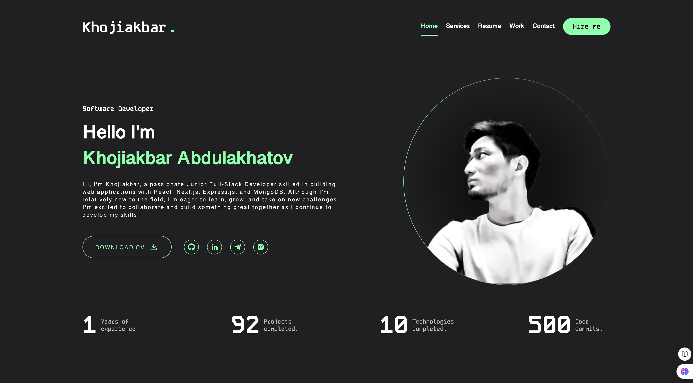

# My Portfolio

Welcome to my portfolio project! This project showcases my work as a junior full-stack developer, highlighting my skills in building dynamic web applications using modern technologies like React, Next.js, Express.js, and MongoDB. Although I am still gaining experience, I am passionate about coding and eager to grow in the field of software development.

## Features

- **Responsive Design**: Optimized for all devices, including desktops, tablets, and smartphones.
- **Dynamic Animations**: Smooth transitions and interactive elements for a better user experience.
- **Modern Tech Stack**: Built using React, Next.js, and Express.js with MongoDB as the database.
- **Reusable Components**: Clean and modular code structure for easier maintenance and scalability.

## Technologies Used

- **Frontend**: React, Next.js, TypeScript, SCSS
- **Backend**: Node.js, Express.js
- **Database**: MongoDB
- **Icons**: React Icons
- **Build Tools**: Vite

## Installation

To run this project locally, follow these steps:

1. Clone the repository:
   ```bash
   git clone https://github.com/khojiakbar63/MY_PORTFOLIO-PRO.git
   ```

2. Navigate to the project directory:
   ```bash
   cd MY_PORTFOLIO-PRO
   ```

3. Install dependencies:
   ```bash
   npm install
   ```

4. Start the development server:
   ```bash
   npm run dev
   ```

5. Open your browser and go to:
   ```
   http://localhost:3000
   ```

## Deployment

This project is deployed on Vercel. You can view the live site here: [My Portfolio](https://myportfolio.vercel.app)

## Issues and Solutions

### 1. **Module Not Found**
   - Ensure that all dependencies are installed by running `npm install`.
   - If you're using `react-icons`, make sure to include the correct import paths.

### 2. **TypeScript Errors**
   - Install missing type definitions:
     ```bash
     npm install --save-dev @types/node
     ```

### 3. **Build Errors on Vercel**
   - Double-check that all modules are included in `package.json`.
   - Ensure the correct Node.js version is specified in the `.nvmrc` file or Vercel settings.

## Roadmap

- Add new sections for projects and achievements.
- Improve performance and SEO.
- Integrate a blog for sharing insights and tutorials.

## Contact

Feel free to reach out if you have any questions or collaboration opportunities:

- **Email**: khojiakbar.abdulakhatov@gmail.com
- **LinkedIn**: [Khojiakbar Abdulakhatov](https://www.linkedin.com/in/xojiakbar-abdulaxatov-b7aa31316/)
- **GitHub**: [khojiakbar63](https://github.com/khojiakbar63)

Thank you for visiting my portfolio!

